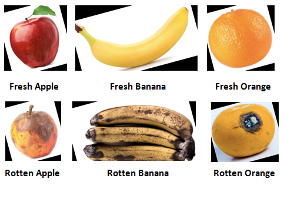
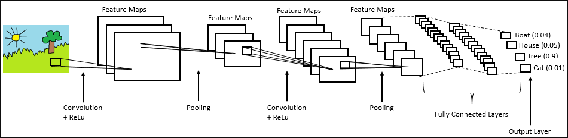
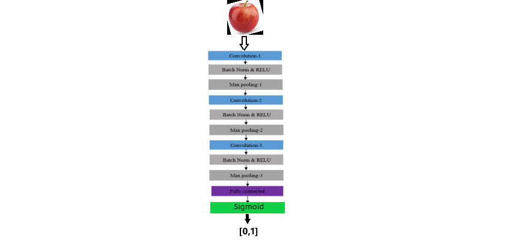
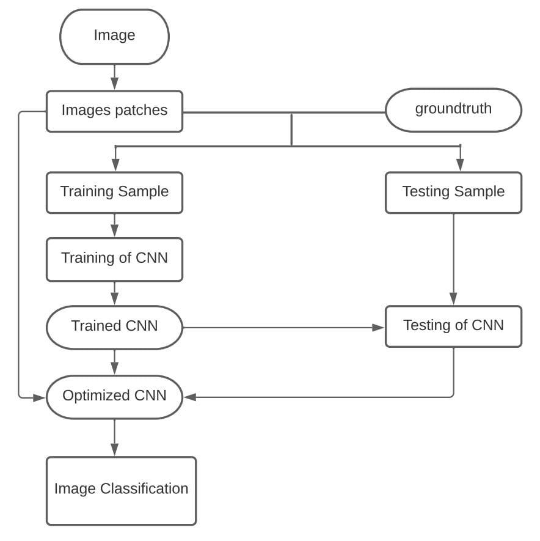
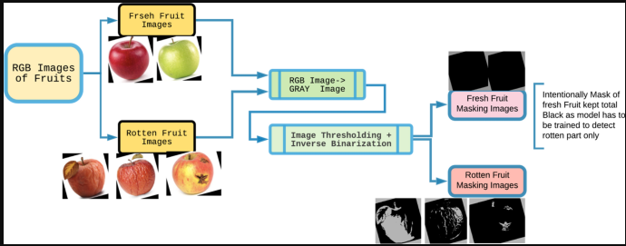

# Fresh-and-Rotten-Fruit-Detection-using-Tensorflow-and-Keras
**Description**

The human eye can detect or analyse the rottenness of fruits, but it is difficult to detect when
the fruits are in bulk. So, for the ease of people, we have developed a model that detects
whether a Fruit is fresh or rotten by using Artificial Intelligence, CNN, and Computer
Vision.

The project works on model that detects whether a Fruit is Fresh or Rotten by using Tensorflow and keras,CNN model and Computer Vision(OpenCV).

 

# Final Results

# Tools and Software
  <li>pandas</li>
  <li>Matplotlib</li>
  <li>Numpy</li>
  <li>Tensorflow and Keras</li>
  <li>OpenCV</li>
  <li>Jupyter Notebook</li>
  <li>Visual Studio Code</li>

# Classes

1.Fresh Fruit

2.Rotten Fruit

# Fruits in Dataset

1.Fresh Apple 

2.Fresh Oranges 

3.Fresh Banana

4.Rotten Apple

5.Rotten Oranges

6.Rotten Banana

# Dataset link

Click on image to get the dataset. 

## Basic of CNN architecture for classificatio n

### CNN Architecture  

### DFD Diagram  

### UML(Unified Modeling Language)  

